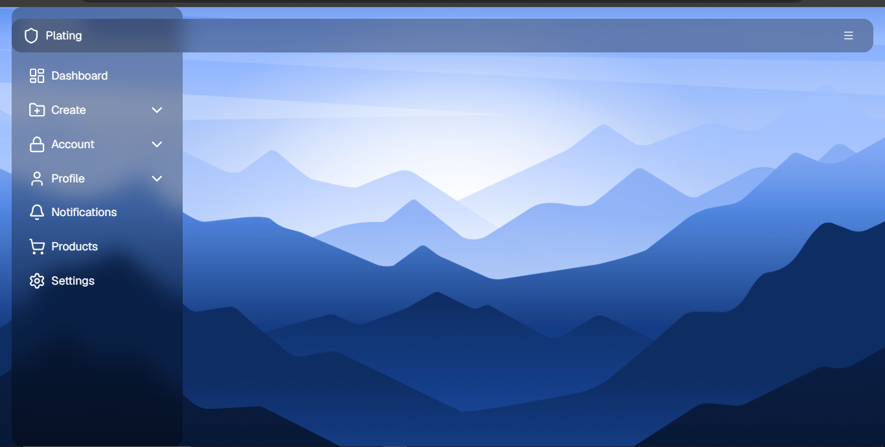

# 🪟 Glass Sidebar

A modern and responsive **Glass Sidebar** built using **React**, **Vite**, **Tailwind CSS**, and **shadcn/ui**.

## ✨ Features

* Glassmorphism sidebar design
* Responsive layout
* Smooth UI
* Modern and clean interface

## 🛠️ Tech Stack

* React
* Vite
* Tailwind CSS
* shadcn/ui
* Lucide React

## 📸 Screenshot





## 🚀 Installation

```bash
git clone https://github.com/your-username/glass-sidebar.git

cd glass-sidebar

npm install

npm run dev
```

## 📁 Project Structure

```text
glass-sidebar/
│
├── public/
│   └── output.png
├── src/
├── package.json
└── README.md
```

## 👩‍💻 Author

**Pranali**

⭐ If you like this project, give it a star on GitHub!
